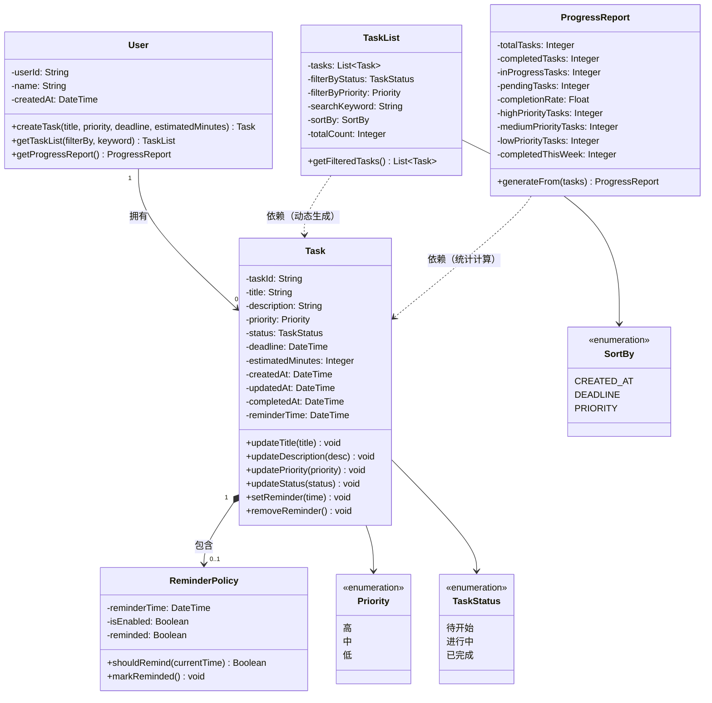

# StudyFlow 学习任务管理系统 —— 领域建模

## 1. 概述

本文档对 StudyFlow 系统进行领域建模分析，识别核心领域对象，明确其属性、类型以及相互之间的关系，并定义系统必须始终满足的不变量。

---

## 2. 核心领域对象

### 2.1 User（用户）

| 项目 | 内容 |
|------|------|
| 类型 | **实体（Entity）** |
| 判断原因 | 每个用户有唯一的用户 ID，即使两个用户的名称相同也不是同一个用户。用户的数据（任务列表）会随着时间变化，但其身份保持不变。 |
| 作用 | 代表使用系统的学生。虽然本系统只有一个用户，但 User 作为所有任务的归属主体，是领域模型的入口。 |

**主要属性：**

| 属性 | 类型 | 说明 |
|------|------|------|
| userId | String | 用户唯一标识，系统自动生成 |
| name | String | 用户名（可选，如"张三"） |
| createdAt | DateTime | 账户创建时间 |

---

### 2.2 Task（任务）

| 项目 | 内容 |
|------|------|
| 类型 | **实体（Entity）** |
| 判断原因 | 每个任务有唯一的任务 ID。任务的属性（如标题、状态）会随时间变化，但其身份保持不变。即使两个任务的标题相同，它们也不是同一个任务。 |
| 作用 | 系统的核心对象，代表一条具体的学习任务。系统中的所有操作（创建、编辑、状态变更、删除）都围绕 Task 展开。 |

**主要属性：**

| 属性 | 类型 | 说明 |
|------|------|------|
| taskId | String | 任务唯一标识，系统自动生成 |
| title | String | 任务标题，必填，如"完成软件构造实验报告" |
| description | String | 任务描述，选填，如"第3-5章内容，含代码实现" |
| priority | Enum | 优先级：高 / 中 / 低，必选 |
| status | Enum | 状态：待开始 / 进行中 / 已完成 |
| deadline | DateTime | 截止日期，选填 |
| estimatedMinutes | Integer | 预计学习时长（分钟），选填 |
| createdAt | DateTime | 创建时间，系统自动记录 |
| updatedAt | DateTime | 最后修改时间，系统自动更新 |
| completedAt | DateTime | 完成时间，任务变为"已完成"时记录 |
| reminderTime | DateTime | 提醒时间，选填 |

---

### 2.3 TaskList（任务列表）

| 项目 | 内容 |
|------|------|
| 类型 | **值对象（Value Object）** |
| 判断原因 | TaskList 是由筛选条件（如状态、优先级）和排序规则决定的查询结果。它的内容完全由底层 Task 数据和查询条件决定，没有独立标识。两个筛选条件相同的 TaskList，如果底层数据相同，就是一样的。生成后不需要长期跟踪其变化。 |
| 作用 | 用于展示学生当前看到的一组任务。支持按状态筛选、按优先级筛选、按关键词搜索以及排序。 |

**主要属性：**

| 属性 | 类型 | 说明 |
|------|------|------|
| tasks | List\<Task\> | 当前列表中的任务集合 |
| filterByStatus | Enum | 当前筛选状态条件（全部 / 待开始 / 进行中 / 已完成） |
| filterByPriority | Enum | 当前筛选优先级条件（全部 / 高 / 中 / 低） |
| searchKeyword | String | 搜索关键词 |
| sortBy | Enum | 排序方式（按创建时间 / 截止时间 / 优先级） |
| totalCount | Integer | 任务总数（不筛选时） |

---

### 2.4 ReminderPolicy（提醒策略）

| 项目 | 内容 |
|------|------|
| 类型 | **值对象（Value Object）** |
| 判断原因 | ReminderPolicy 描述的是"何时提醒、如何提醒"的配置规则。两个配置完全一样的提醒策略没有区别。它没有独立于 Task 的生命周期，通常嵌入在 Task 中使用。 |
| 作用 | 定义任务的提醒规则。学生在创建或编辑任务时可以设置提醒时间，系统在指定时间提醒学生。 |

**主要属性：**

| 属性 | 类型 | 说明 |
|------|------|------|
| reminderTime | DateTime | 提醒的具体时间，精确到分钟 |
| isEnabled | Boolean | 提醒是否启用 |
| reminded | Boolean | 是否已经提醒过（防止重复提醒） |

---

### 2.5 ProgressReport（进度报告）

| 项目 | 内容 |
|------|------|
| 类型 | **值对象（Value Object）** |
| 判断原因 | ProgressReport 是根据当前所有 Task 数据实时计算生成的统计结果。它的值完全由底层数据决定，没有独立标识。每次打开统计页面都是重新生成的，不需要保存到数据库中。 |
| 作用 | 展示学生的学习进度和统计数据，帮助学生了解自己的学习情况。 |

**主要属性：**

| 属性 | 类型 | 说明 |
|------|------|------|
| totalTasks | Integer | 总任务数 |
| completedTasks | Integer | 已完成任务数 |
| inProgressTasks | Integer | 进行中任务数 |
| pendingTasks | Integer | 待开始任务数 |
| completionRate | Float | 完成率（completedTasks / totalTasks × 100%） |
| highPriorityTasks | Integer | 高优先级任务数 |
| mediumPriorityTasks | Integer | 中优先级任务数 |
| lowPriorityTasks | Integer | 低优先级任务数 |
| completedThisWeek | Integer | 近7天内完成的任务数 |

---

## 3. UML 类图



### 类图说明

| 元素 | 说明 |
|------|------|
| **类（矩形框）** | 分三栏：类名、属性（- 表示 private）、方法（+ 表示 public） |
| **实线箭头 `-->`** | 关联关系。如 User 关联 Task，表示 User 拥有 Task |
| **实心菱形 `*-->`** | 组合关系。Task 组合 ReminderPolicy，表示 ReminderPolicy 的生命周期跟随 Task，Task 删除时 ReminderPolicy 也一起删除 |
| **虚线箭头 `..>`** | 依赖关系。TaskList 和 ProgressReport 都依赖 Task 来生成数据，它们本身不存储 Task |
| **`<<enumeration>>`** | 枚举类型，列出所有取值 |

---

## 4. 领域对象关系图

```
User (1) ────── 拥有 ──────▶ Task (*)
  │                            │
  │                            ├── 可设置 ───▶ ReminderPolicy (0..1)
  │                            │
  │                            └── 产生 ───▶ ProgressReport
  │
  └── 查看 ────▶ TaskList（由 Task 动态生成）
```

### 关系说明

| 关系 | 说明 |
|------|------|
| User → Task | **一对多**。一个用户可以创建多个任务，每个任务只能属于一个用户。任务的创建者和拥有者始终是同一个人。 |
| User → TaskList | **使用关系**。用户通过筛选条件查看任务列表，TaskList 由系统根据当前所有 Task 实时生成，不独立存储。 |
| Task → ReminderPolicy | **组合关系**。一个 Task 可以包含一个提醒策略，也可以不包含。提醒策略嵌入在 Task 中，Task 被删除时提醒策略也一并删除。 |
| Task → ProgressReport | **派生关系**。ProgressReport 是根据所有 Task 的数据统计计算得出的，Task 数据变化会反映到报告中。 |

---

## 5. 实体（Entity）与值对象（Value Object）分类

### 实体（Entity）

| 对象 | 判断依据 |
|------|---------|
| **User** | 拥有唯一标识（userId），属性可以变化但身份不变。系统需要区分不同的用户。 |
| **Task** | 拥有唯一标识（taskId），属性（标题、状态等）会随操作而变化，但任务的身份始终不变。系统需要持续跟踪每个任务的独立生命周期。 |

### 值对象（Value Object）

| 对象 | 判断依据 |
|------|---------|
| **TaskList** | 由筛选条件和底层 Task 数据决定。没有独立标识，每次查询时根据条件重新生成。两个相同的筛选条件得到相同的列表（底层数据一致时）。 |
| **ReminderPolicy** | 由提醒时间和启用状态等属性定义。嵌入在 Task 中使用，没有独立生命周期。属性完全相同时可视为相同。 |
| **ProgressReport** | 根据 Task 数据实时计算生成。没有独立标识，每次访问统计页面时重新计算，不需要持久化存储。 |

---

## 6. 关键不变量（Invariant）

不变量是系统在运行过程中必须始终保持成立的规则，无论执行什么操作都不能破坏。

### INV-01 任务截止时间不能早于创建时间

任务设置的截止日期必须晚于或等于任务的创建时间。如果一个任务的创建时间是 2026-05-26 10:00，那么它的截止日期不能小于这个时间。

**违反示例：** 创建时间为 2026-05-26，截止日期填 2026-05-25 → 系统应拒绝。

### INV-02 高优先级任务必须设置截止日期

当学生将任务优先级设为"高"时，必须同时设置截止日期，不允许高优先级任务没有截止日期。

**违反示例：** 选择优先级为"高"，但不填写截止日期直接提交 → 系统应提示"高优先级任务必须设置截止日期"。

### INV-03 任务标题不能为空

每条任务的标题至少包含一个非空字符（不包括空格）。标题是任务最基本的标识信息，不允许为空。

**违反示例：** 标题填写空格或不填直接提交 → 系统应提示"任务标题不能为空"。

### INV-04 任务状态转换必须遵循允许路径

任务的状态只能在以下路径中转换，不允许随意跳转：

```
待开始 ──→ 进行中 ──→ 已完成
  ↑                      │
  └──────────┘
```

说明：
- 从"待开始"可以变为"进行中"
- 从"进行中"可以变为"已完成"
- 从"已完成"可以重置为"待开始"（重新做）
- 不允许"待开始"直接变为"已完成"
- 不允许"已完成"直接变为"进行中"

**违反示例：** 状态为"待开始"的任务直接标记为"已完成" → 系统应拒绝，必须经过"进行中"。

### INV-05 提醒时间不能晚于任务截止日期

如果任务同时设置了提醒时间和截止日期，提醒时间必须早于或等于截止日期。提前提醒才有意义。

**违反示例：** 截止日期为 2026-06-10，提醒时间设置为 2026-06-11 → 系统应提示"提醒时间不能晚于截止日期"。

### INV-06 任务完成率始终在 0% 到 100% 之间

当总任务数大于 0 时，完成率 = 已完成任务数 ÷ 总任务数 × 100%，计算结果必须在 [0, 100] 范围内。

**违反示例：** 系统计算出完成率为 120% → 说明存在数据错误。

---

## 7. 领域对象与需求的追溯

| 领域对象 | 关联的功能需求 | 涉及的不变量 |
|----------|--------------|-------------|
| User | FR-01 ~ FR-10（所有功能的使用者） | - |
| Task | FR-01 创建任务、FR-03 设置优先级、FR-04 更新状态、FR-05 编辑任务、FR-06 删除任务 | INV-01, INV-02, INV-03, INV-04, INV-05 |
| TaskList | FR-02 查看列表、FR-07 筛选搜索、FR-10 搜索 | - |
| ReminderPolicy | FR-09 设置提醒 | INV-05 |
| ProgressReport | FR-08 查看统计 | INV-06 |

---

## 8. 简单理解总结

- **Task（任务）** 是系统的核心，所有功能都是围绕它设计的。
- **User（用户）** 是任务的主人，在本系统中就是学生自己。
- **TaskList（任务列表）** 不是存起来的数据，而是每次打开页面时"算出来"的。
- **ReminderPolicy（提醒策略）** 依附于任务，不会独立存在。
- **ProgressReport（进度报告）** 同样是"算出来"的数据，不用保存。
- **不变量** 就是系统打死也不能违反的规矩，比如"标题不能为空""状态不能乱跳"。
